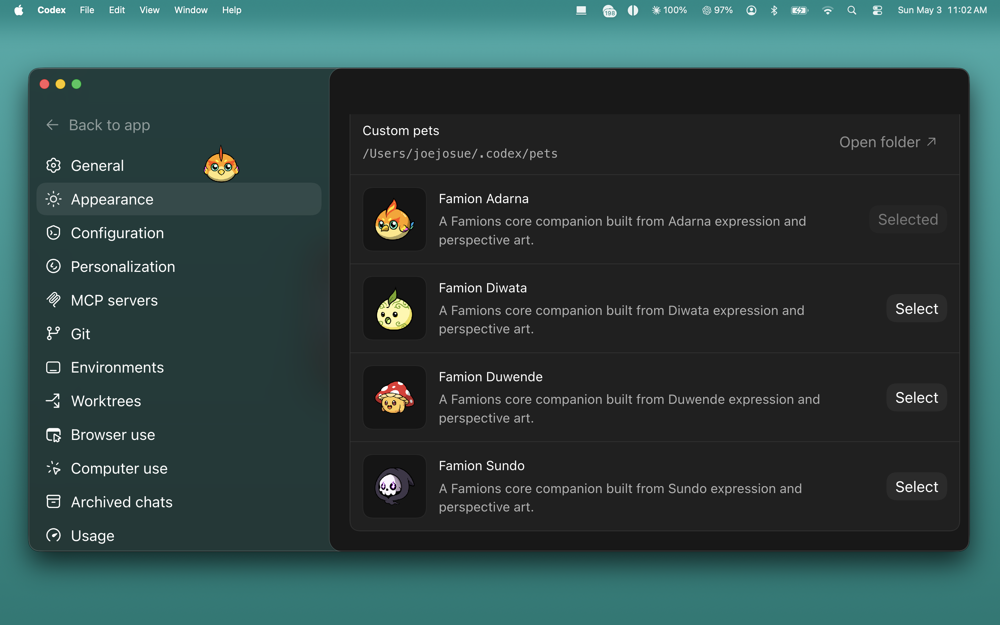
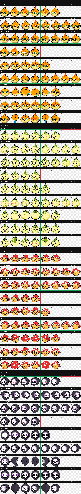

# Famion Codex Pets

Custom Codex pets for the Famions core four: Adarna, Diwata, Duwende, and Sundo.

[Download](./downloads/famion-codex-pets.zip) · [Install](#install) · [Codex Pets](#about-codex-pets) · [Famions](#about-famions) · [Credits](#credits)



## Overview

Famion Codex Pets packages the Famions core character set as local custom pets for the Codex desktop app.

Each pet is ready to install in the Codex custom pet format:

```text
<pet-id>/
├── pet.json
└── spritesheet.webp
```

Included pets:

- `famion-adarna` — Famion Adarna
- `famion-diwata` — Famion Diwata
- `famion-duwende` — Famion Duwende
- `famion-sundo` — Famion Sundo



## Download

Download the latest packaged pet folders:

[downloads/famion-codex-pets.zip](./downloads/famion-codex-pets.zip)

The zip contains the four installable pet folders. Each folder includes only the files Codex needs: `pet.json` and `spritesheet.webp`.

## Install

### Option 1: Install with the script

Clone this repo, then run:

```bash
./scripts/install_famion_pets.sh
```

The script copies the four pet folders into:

```text
${CODEX_HOME:-$HOME/.codex}/pets/
```

### Option 2: Manual install

Download and unzip [famion-codex-pets.zip](./downloads/famion-codex-pets.zip), then copy the four folders into your local Codex pets directory:

```text
~/.codex/pets/famion-adarna
~/.codex/pets/famion-diwata
~/.codex/pets/famion-duwende
~/.codex/pets/famion-sundo
```

Each folder must contain:

```text
pet.json
spritesheet.webp
```

## Use In Codex

1. Open Codex Settings.
2. Go to Appearance.
3. Open Pets.
4. Refresh custom pets from your local Codex home.
5. Select one of the Famion pets.
6. Type `/pet` in the composer, or use Wake Pet / Tuck Away Pet from the command menu.

Official OpenAI guide: [Codex Pets settings](https://developers.openai.com/codex/app/settings#codex-pets).

## Animation Notes

- `idle` keeps the character calm with subtle blink and breathing frames.
- `waiting` uses Famions perspective assets as a 6-frame 360-style turn.
- `running-left` and `running-right` use the idle/expression pose with horizontal mirroring.

## What Is Included

- `dist/pets/` — ready-to-install Codex pet folders.
- `downloads/famion-codex-pets.zip` — packaged copy of the four installable pet folders.
- `assets/` — preview images used by this README.
- `docs/INSTALL.md` — install guide with the same steps in a focused handoff format.
- `scripts/install_famion_pets.sh` — local installer script.

## About Codex Pets

Codex pets are optional animated companions for the Codex desktop app. Custom pets are local packages loaded from your Codex home folder. A custom pet package contains a short `pet.json` manifest and a `spritesheet.webp` atlas.

These Famion pets use the Codex pet atlas layout:

- `1536x1872` spritesheet
- `8` columns by `9` rows
- `192x208` cell size
- transparent unused cells
- WebP spritesheet with alpha

## About Famions

Famions is a character brand centered on a core cast of Filipino-inspired familiars. This repo adapts the core four characters into small animated Codex companions while preserving their silhouettes, expressions, and character identity.

Learn more at [famions.com](https://www.famions.com/).

## Credits

- Famions character brand: Joe Josue and collaborators.
- Resident Famions artist: RageBoi.
- Codex pet packaging and implementation: Joe Josue / AhensyaHQ.

## License

Famions character art, names, marks, generated pet spritesheets, and related brand materials are provided for personal Codex pet use only unless a separate written license says otherwise. See [LICENSE](./LICENSE).

